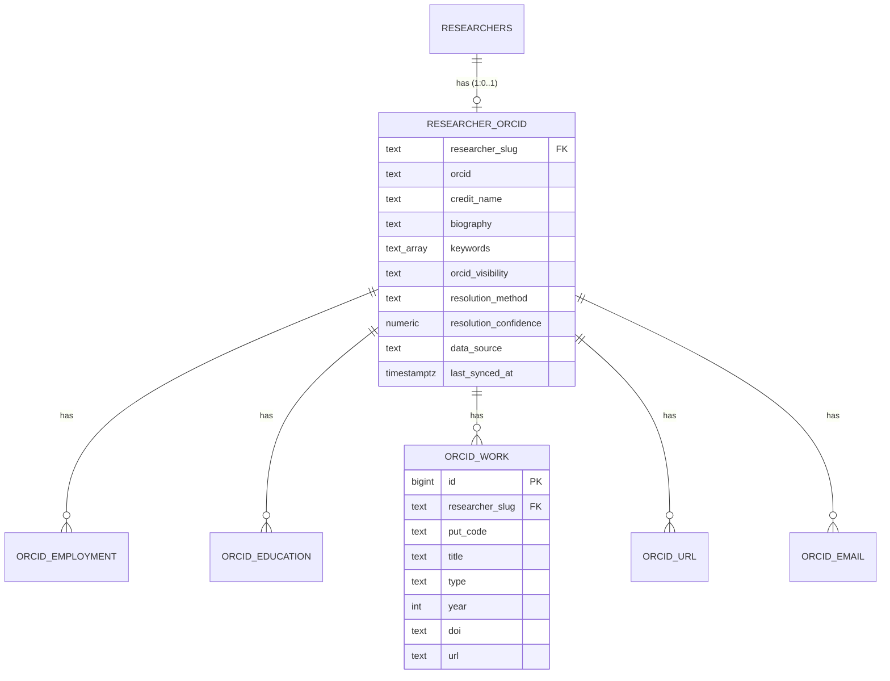

# Epic: Wire ORCID public records into selltoscientists.com

## Overview

Researcher pages on selltoscientists.com (`researchreach` repo, DB-driven from Supabase `uezyvflphqcizcbfklla.public.researchers`) currently show a thin profile: name, institution, field, h-index, grant/patent/publication counts, a description, and — for 91 of 236 researchers — a bare ORCID iD.

This epic pulls each researcher's **full public ORCID record** into our DB and renders it. New researchers added by the daily SEO subroutine get enriched automatically. Result: richer, more unique, more authoritative pages (E-E-A-T + SEO) and a real "who is this scientist" surface for buyers.

Source of truth for API mechanics: [ORCID — Read data on a record](https://info.orcid.org/documentation/api-tutorials/api-tutorial-read-data-on-a-record/). Legal + CC0 analysis lives in [`legal-and-cc0.md`](./legal-and-cc0.md).

## Decisions (2026-06-03)

| # | Decision | Consequence |
|---|----------|-------------|
| D1 | Scope = curated 236 now, grow via SEO subroutine. | No mass enumeration. |
| D2 | Scaling past curated set BLOCKED on PICO data-licensing agreement. | Full-directory deferred. |
| D3 | Access = live Public API now, §2 non-commercial risk knowingly accepted. | Made bounded + reversible via T02. |
| D4 | Missing iDs (145/236) = auto-resolve, verified-only. | No namesake guesses. |
| D5 | Display = professional record + works + bio/keywords/links + emails. | Emails gated off by default (T13). |

## Acceptance criteria

- [ ] Two-legged-OAuth ORCID Public API client, throttled well under limits, 503 back-off, hard per-run cap (never continuous polling).
- [ ] All 91 researchers with a stored iD enriched: employments, educations, works, biography, keywords, URLs, public emails in DB.
- [ ] Of the 145 without an iD, every one that clears the strict confidence bar is resolved + enriched; rest flagged `unresolved`. **Zero wrong-person matches** in a 20-row audit.
- [ ] Only **public-visibility** items are ever stored.
- [ ] A re-sync **reconciles deletions**: vanished/now-non-public items are removed from DB + page.
- [ ] Pages render new sections with a correctly-formatted ORCID iD (green icon + `https://orcid.org/{iD}`).
- [ ] Email display **off by default**, single env flag, no code change to toggle.
- [ ] Per-field provenance recorded (`orcid` / `openalex` / `curated`).
- [ ] Data source behind a **swap-able interface**: Public API → CC0 file → Member API = one-file change.
- [ ] JSON-LD enriched (`sameAs` ORCID, `affiliation`/`alumniOf`) and still validates.
- [ ] SEO subroutine calls enrichment for each newly-added researcher.
- [ ] GDPR LIA note + opt-out/removal path exist (T14).

## Out of scope

- **Full-directory ingestion** — blocked on PICO; and must use CC0 file, not API.
- **Member API / `/read-limited`** — future, needs membership + commercial agreement.
- **Funding & peer-review sections** — phase 2.
- **Re-hosting linked full-text/datasets** — ORCID §2 excludes these; link out only.
- **Non-researcher pillars.**

## Data model

Flat relational, FKs to `researchers` (no JSONB blobs). **All DDL via `supabase migration new` + `supabase db push --linked`** — never raw SQL / MCP / dashboard. Full DDL spec in [T03](./T03-db-migration.md).



`put_code` (ORCID's per-item id) is the unique key per child row `(researcher_slug, put_code)` — it powers upsert AND deletion detection.

## Enrichment flow

```mermaid
sequenceDiagram
    participant Sub as SEO subroutine / backfill
    participant R as resolve.py
    participant OA as OpenAlex (openalex.py)
    participant API as ORCID Public API
    participant T as transform.py
    participant DB as Supabase

    Sub->>R: researcher (slug, name, institution, orcid?)
    alt orcid stored
        R-->>API: GET /v3.0/{iD}/record
    else no orcid
        R->>API: GET /v3.0/expanded-search (name, affiliation)
        R->>OA: cross-check ORCID-on-author + institution
        R->>R: score; below bar → unresolved, STOP
        R-->>API: GET /v3.0/{iD}/record  (verified iD only)
    end
    API-->>T: record JSON (public items)
    T->>T: filter visibility=public, map to flat rows, tag provenance
    T->>DB: upsert researcher_orcid + child rows (by put_code)
    T->>DB: delete child rows whose put_code vanished (reconcile)
```

## API reference (ORCID v3.0, verified)

**Token (two-legged):**
```
POST https://orcid.org/oauth/token
Content-Type: application/x-www-form-urlencoded
client_id=…&client_secret=…&grant_type=client_credentials&scope=/read-public
→ { "access_token":"…", "scope":"/read-public", "expires_in":631138518 }
```
**Read a record:**
```
GET https://pub.orcid.org/v3.0/{iD}/record
Accept: application/json
Authorization: Bearer {token}
→ person{ name, biography, keywords, researcher-urls, emails, external-identifiers }
  activities-summary{ employments, educations, works:{group[]}, fundings }
```
Every item carries `visibility` (`public|limited|private`) + `put-code`. Bulk works: `GET /v3.0/{iD}/works/{pc1},{pc2}` (≤100). 503 = burst exceeded → back off.

**Resolve name → iD:**
```
GET https://pub.orcid.org/v3.0/expanded-search/?q=family-name:{x}+AND+given-names:{y}+AND+affiliation-org-name:{org}
→ expanded-result[]{ orcid-id, given-names, family-names, institution-name[] }
```
